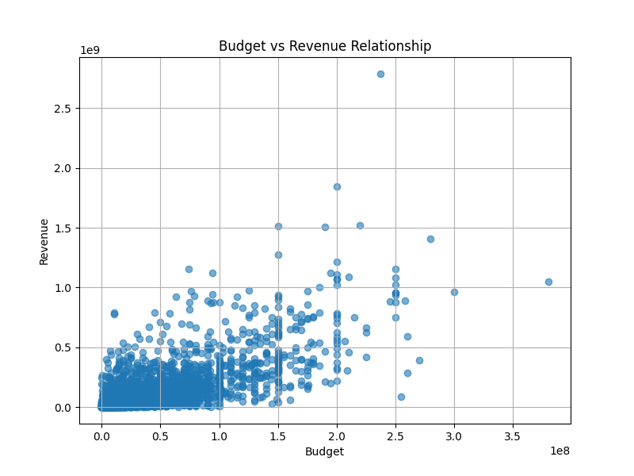
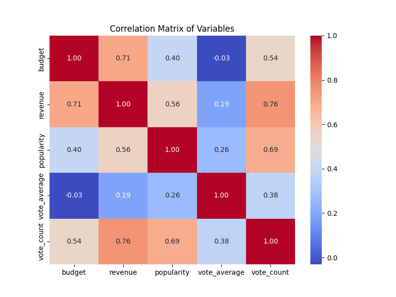
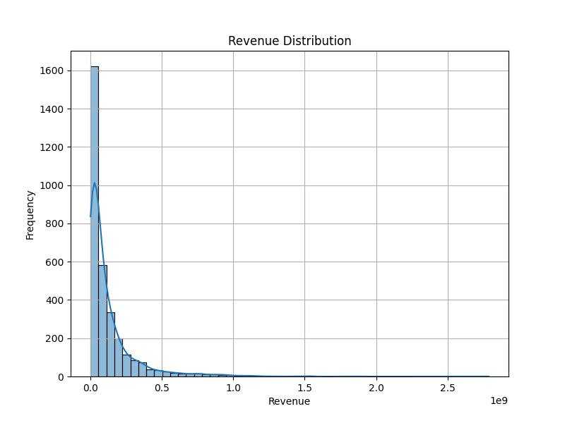
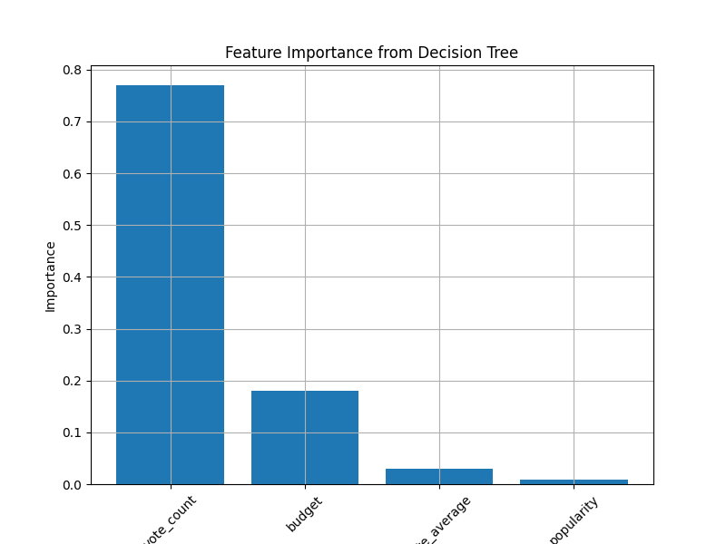
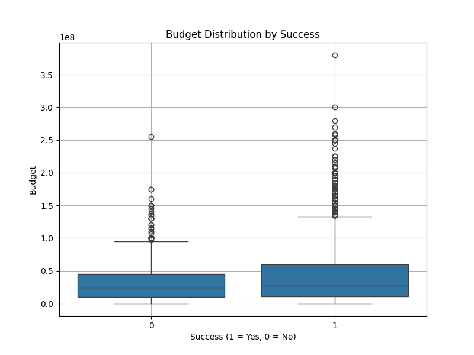
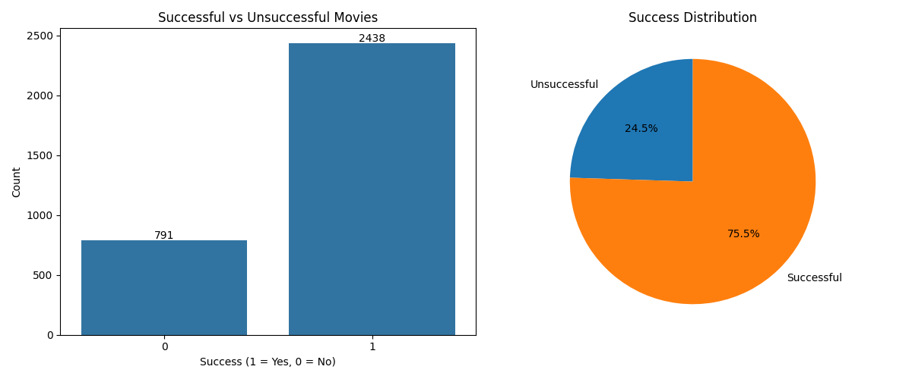

# What Factors Affects Movies Success Analysis (DSA210 Project)

---

## 1. Motivation

As someone who enjoys watching movies, I’ve always wondered why some films become extremely successful while others fail despite having high budgets.

The main research question of this project is:

What factors determine whether a movie becomes financially successful?

---

## 2. Data Source

The dataset used in this project is the TMDB 5000 Movies Dataset, which contains detailed information about movies including financial performance, popularity, and audience-related metrics.

### Data Preprocessing

Before analysis, the dataset was cleaned and preprocessed to ensure consistency and usability. This included handling missing values, selecting relevant variables, and focusing on numerical features suitable for statistical and machine learning analysis.

After preprocessing:

- Total observations: **~3229 movies**
- Selected features:
  - **budget** → production cost of the movie
  - **revenue** → total revenue generated
  - **popularity** → popularity score provided by TMDB
  - **vote_average** → average rating of the movie
  - **vote_count** → number of votes (audience engagement)

---

### Definition of Success

In this project, a movie is defined as **successful if its revenue exceeds its budget (revenue > budget)** for making classification easier.

---

## 3. Exploratory Data Analysis (EDA)

---

### 3.1 Budget vs Revenue Relationship

**Findings:**
- Strong positive relationship observed
- Correlation ≈ **0.70**
- Higher budget generally leads to higher revenue

**Interpretation:**
- Budget is an important factor
- However, large variance shows budget alone is not enough

---

### 3.2 Correlation Matrix

**Key Values:**
- budget vs revenue → **0.71**
- revenue vs vote_count → **0.76**
- popularity vs vote_count → **0.69**
- vote_average has weak correlations

**Interpretation:**
- Revenue is strongly linked with audience engagement
- vote_count is highly influential

---

### 3.3 Revenue Distribution

**Findings:**
- Highly right-skewed distribution
- Most movies generate low revenue
- Few movies generate extremely high revenue (outliers)

**Interpretation:**
- Movie revenue is not normally distributed
- Extreme successes dominate the market

---

## 4. Machine Learning Analysis

---

### 4.1 Linear Regression

Used to predict revenue.

**Results:**
- R² score: **0.657**
- RMSE: **~131 million**

**Interpretation:**
- Model explains ~65% of variance
- Indicates moderate predictive power

---

### 4.2 Decision Tree Classification

Used to classify success (1) vs failure (0)

**Results:**
- Accuracy: **~79.8%**

**Interpretation:**
- Model performs well for classification
- Combining variables improves prediction

---

### 4.3 Feature Importance

**Results:**
- vote_count → **~0.77**
- budget → **~0.18**
- vote_average → **~0.03**
- popularity → **~0.009**

**Interpretation:**
- vote_count dominates prediction
- Audience engagement > budget

---

## 5. Hypothesis Testing

---

### Hypothesis:

- H0: Budget has no effect on revenue
- H1: Budget affects revenue

---

### 5.1 Statistical Evidence

- Correlation ≈ **0.70**
- Strong positive relationship observed

**Decision:**
- H0 is rejected

---

### 5.2 Budget Distribution by Success

**Findings:**
- Successful movies have higher median budgets
- Unsuccessful movies concentrated at lower budgets
- Overlap exists

**Interpretation:**
- Budget contributes to success
- But is not the only determining factor

---

### 5.3 Success Distribution

**Results:**
- Successful: **2438 (~75.5%)**
- Unsuccessful: **791 (~24.5%)**

**Interpretation:**
- Dataset is imbalanced
- Majority of movies are profitable

---

## 6. Results & Discussion

- Budget positively affects revenue
- vote_count is the strongest predictor
- Revenue depends on multiple factors

**Key Insight:**
Audience engagement is more important than budget alone.

---

## 7. Conclusion

This project analyzed the key factors influencing movie success using both statistical methods and machine learning techniques.

The results consistently indicate that **budget has a statistically significant positive effect on revenue**, supported by correlation (~0.70) and visual analysis. However, budget alone does not fully explain success due to high variability.

The linear regression model (R² ≈ 0.65) shows moderate predictive power, indicating that additional variables influence outcomes. The decision tree model (accuracy ≈ 79.8%) confirms that combining features improves classification performance.

The most important finding is that **vote_count (~0.77 importance)** is the dominant feature. This suggests that **audience engagement plays a larger role than budget** in determining success.

Overall:
- Budget matters
- Audience matters more
- Success is multi-factorial

---

## 8. Limitations & Future Work

### Limitations:
- Dataset size (~3000 movies)
- Missing variables (marketing, timing)
- Simplified success definition (revenue > budget)